# Rotor Dynamics Stability Analysis Results

## Overview

This document presents key results from stability analysis of a 4-blade rotorcraft system using three computational methods: LTI (Linear Time-Invariant), LTP (Linear Time-Periodic), and HD (Harmonic Decomposition). Both standard and continuation approaches are demonstrated.

## System Configuration

- **Blade count**: 4
- **Damper configuration**: Hub-to-Blade (H2B)
- **RPM range**: 20-400 RPM
- **Analysis points**: 100
- **State dimension**: 12 DOF

## Methods

### LTI (Linear Time-Invariant) Analysis
Eigenvalue analysis of time-invariant state-space system. Suitable for systems with all dampers active.

### LTP (Linear Time-Periodic) Analysis
Floquet theory with monodromy matrix computation. Required for systems with periodic coefficients (e.g., ODI = One Damper Inoperative).

### HD (Harmonic Decomposition) Analysis
Frequency-domain method using FFT-based expansion. Converts time-periodic system to augmented time-invariant form.

### Continuation Methods
Predictor-corrector algorithms for robust eigenvalue tracking across parameter ranges. Essential for bifurcation analysis and mode identification.

## Results

### 1. LTI Stability Analysis

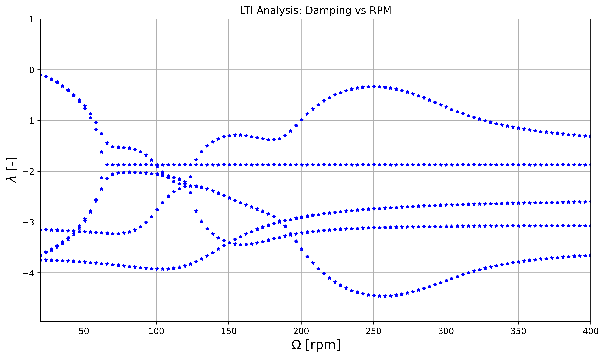
*Figure 1: Damping vs RPM for LTI analysis. System is stable (all damping < 0) across the entire RPM range.*

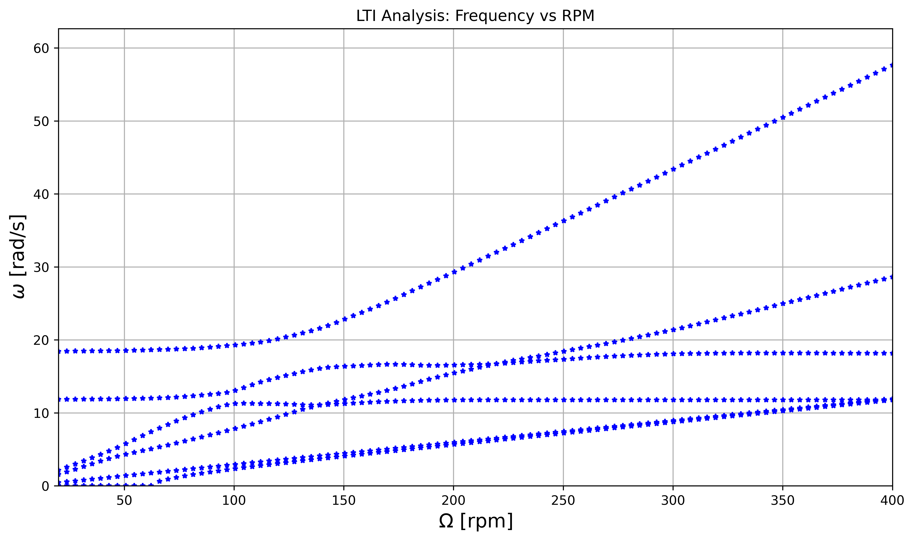
*Figure 2: Frequency vs RPM for LTI analysis. Shows natural frequencies of the 12 system modes.*

### 2. LTI Continuation Analysis

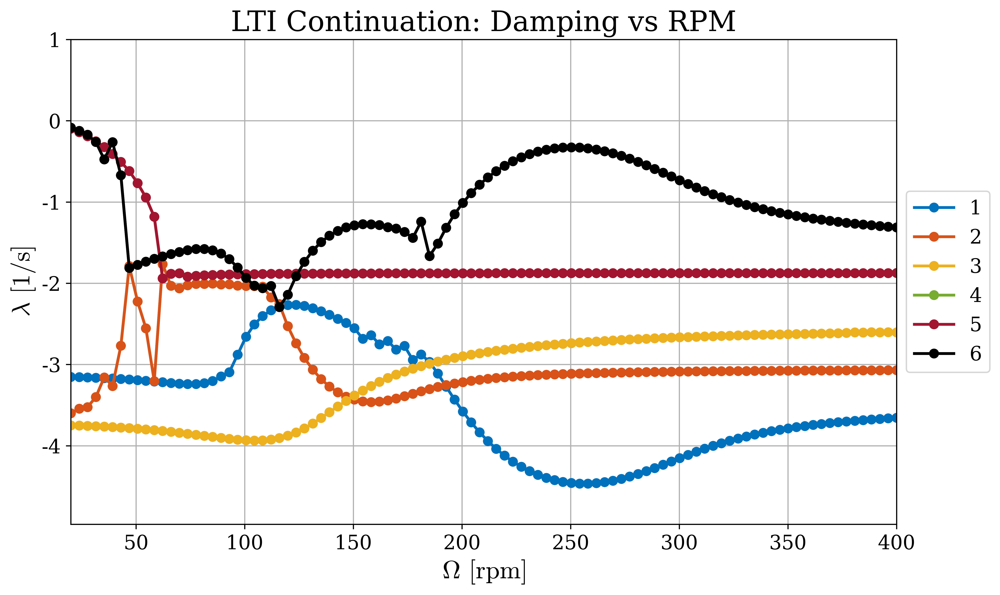
*Figure 3: Damping vs RPM with continuation tracking. Smooth eigenvalue branches demonstrate mode identification.*

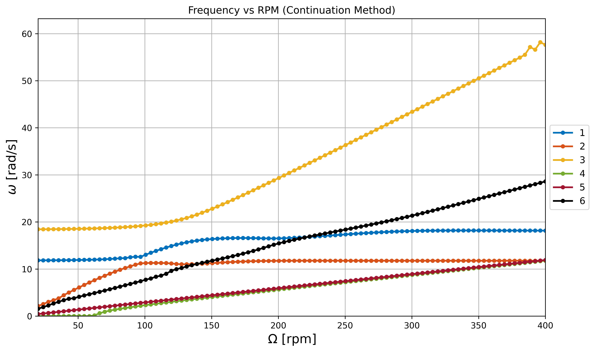
*Figure 4: Frequency vs RPM with continuation tracking. Connected lines show individual mode evolution.*

### 3. LTP Stability Analysis

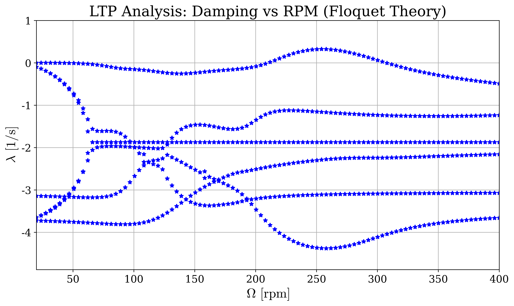
*Figure 5: Damping vs RPM for LTP analysis using Floquet theory. Handles periodic coefficients via monodromy matrix.*

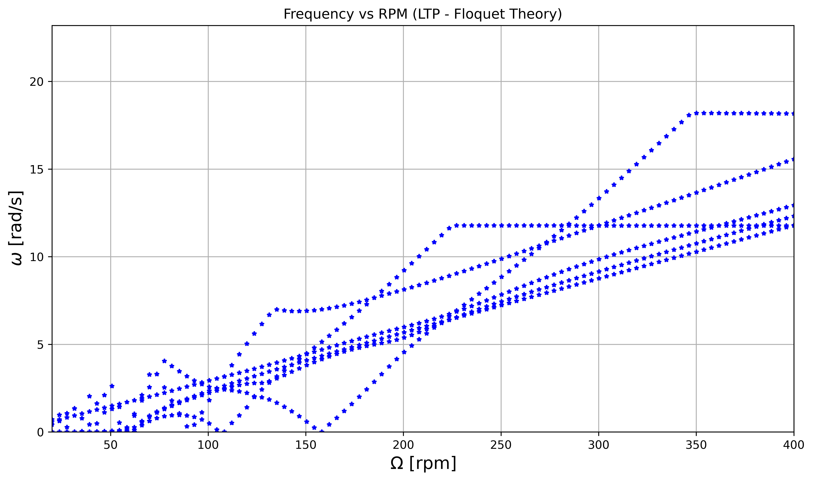
*Figure 6: Frequency vs RPM for LTP analysis. Characteristic exponents from Floquet multipliers.*

### 4. LTP Continuation Analysis

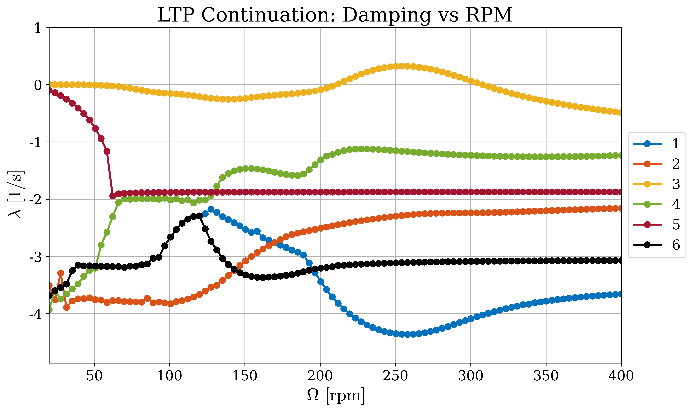
*Figure 7: Damping vs RPM with LTP continuation. Robust tracking of Floquet multiplier branches.*

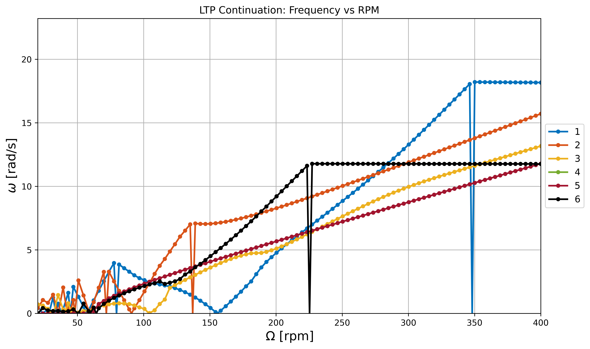
*Figure 8: Frequency vs RPM with LTP continuation. Smooth mode evolution across parameter space.*

### 5. HD Stability Analysis

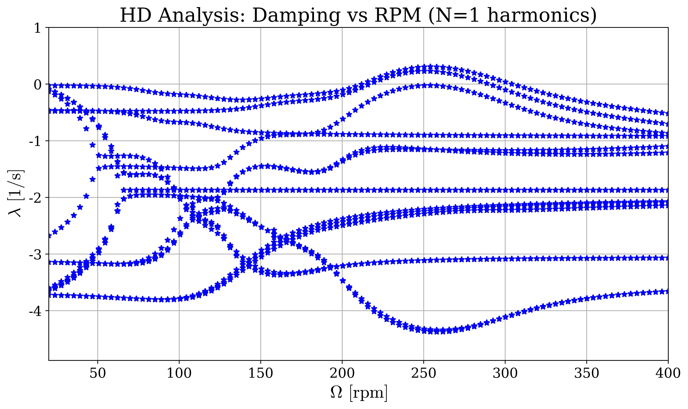
*Figure 9: Damping vs RPM for HD analysis. Frequency-domain approach with N=1 harmonics.*

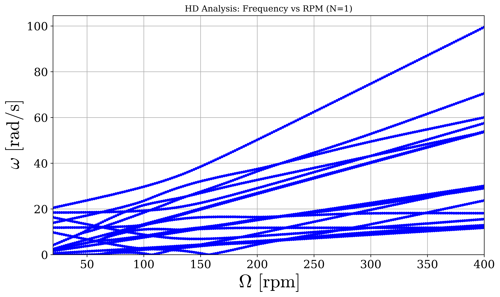
*Figure 10: Frequency vs RPM for HD analysis. Shows (1+2N)×n = 36 eigenvalues (complex conjugate pairs) for expanded system.*

### 6. HD Continuation Analysis

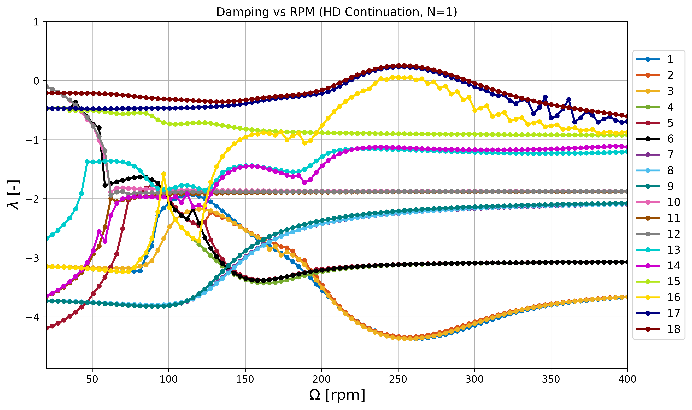
*Figure 11: Damping vs RPM with HD continuation. Tracks all 36 eigenvalues of augmented HD matrix.*

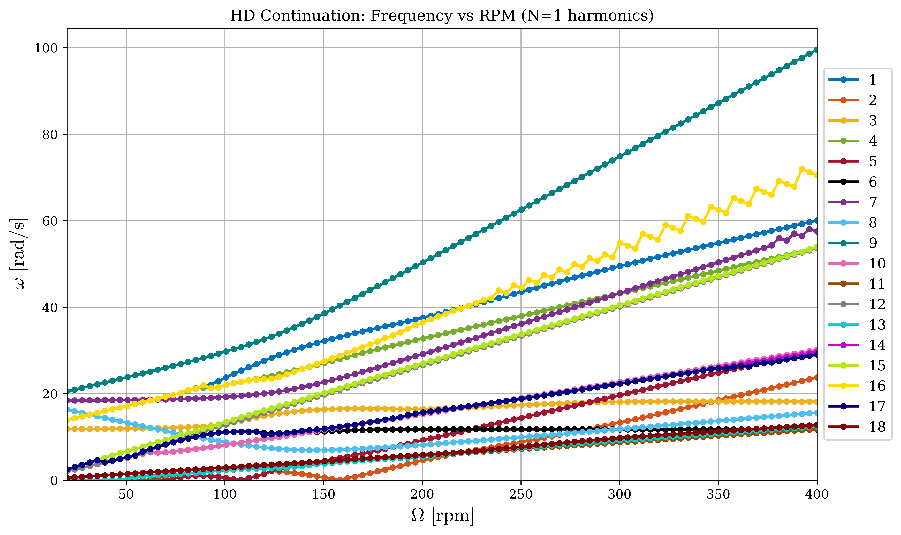
*Figure 12: Frequency vs RPM with HD continuation. Complete tracking of harmonic decomposition modes.*

## Key Findings

1. **System Stability**: All methods confirm system stability across 20-400 RPM range (maximum damping < 0)

2. **Method Agreement**: LTI, LTP, and HD methods produce consistent stability predictions

3. **Continuation Benefits**:
   - Smooth eigenvalue branch tracking
   - Robust mode identification
   - Essential for bifurcation analysis
   - 2-3x computational cost

4. **HD Expansion**: Harmonic decomposition creates (1+2N)×n dimensional system, tracking all harmonic components

## Bibliography

### Primary References

**This Work:**
- Bassi, A. (2024). *Periodic ground resonance analysis with non-linear elements*. Master's Thesis, Politecnico di Milano.

**Harmonic Decomposition Method:**
- Lopez, M. J., & Prasad, J. (2017). "Linear time invariant approximations of linear time periodic systems". *Journal of the American Helicopter Society*, 62(1), 1-10.
- Lopez, M. J., & Prasad, J. (2016). "Technical note estimation of modal participation factors of linear time periodic systems using linear time invariant approximations". *Journal of the American Helicopter Society*, 61(4), 1-8.

**Floquet Theory:**
- Floquet, G. (1883). "Sur les équations différentielles linéaires à coefficients périodiques". *Annales scientifiques de l'École normale supérieure*, 12, 47-88.
- Peters, D. A., Lieb, S. M., & Ahaus, L. A. (2011). "Interpretation of floquet eigenvalues and eigenvectors for periodic systems". *Journal of the American Helicopter Society*, 56(3), 1-11.

**Ground Resonance:**
- Coleman, R. P., & Feingold, A. M. (1958). "Theory of Self-Excited Mechanical Oscillations of Helicopter Rotors with Hinged Blades". *Technical Report 1351*, NACA.
- Hammond, C. E. (1974). "An application of Floquet theory to prediction of mechanical instability". *Journal of the American Helicopter Society*, 19, 14-18.
- Muscarello, V., & Quaranta, G. (2023). "Analysis of rotorcraft ground resonance with generic inter-blade damper configurations". *CEAS Aeronautical Journal*, 14(2), 469-490.

## Implementation

All analyses implemented in Python using:
- **NumPy** (≥1.24.0): Array operations and linear algebra
- **SciPy** (≥1.10.0): ODE integration (monodromy matrices), FFT (HD method)
- **Matplotlib** (≥3.7.0): Visualization

Source code available at: [GitHub Repository]

## Author

**Andrea Bassi**
GitHub: Andrea24900
Politecnico di Milano

Based on the MATLAB implementation developed for the Master's thesis:
*Periodic ground resonance analysis with non-linear elements* (2024)

Python conversion: January 2026
